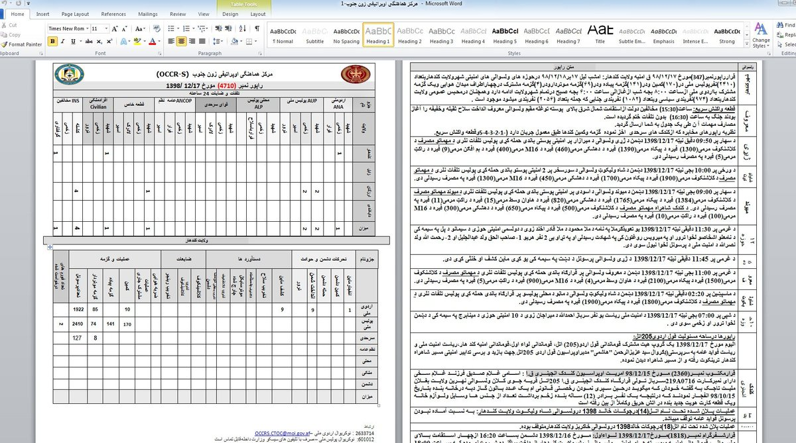

##User: RedDrip7	Time: 20200311
>  #project	 #afghanistan	 #occr	 #transparent	
> #Project-M  

New sample, pretends to be #Afghanistan #OCCR-S related, seems used by #Transparent Tribe. Once it gets executed, a document relating to OCCR-S is shown to confuse the victim and meanwhile Crimson RAT is executed to perform remote control.

 https://www.virustotal.com/gui/file/6230a788275ab978119b0a96c8eb76fffe7dd25d2c441a2d720eaa3b43872db8/details … pic.twitter.com/vUp88xOd4u
 
