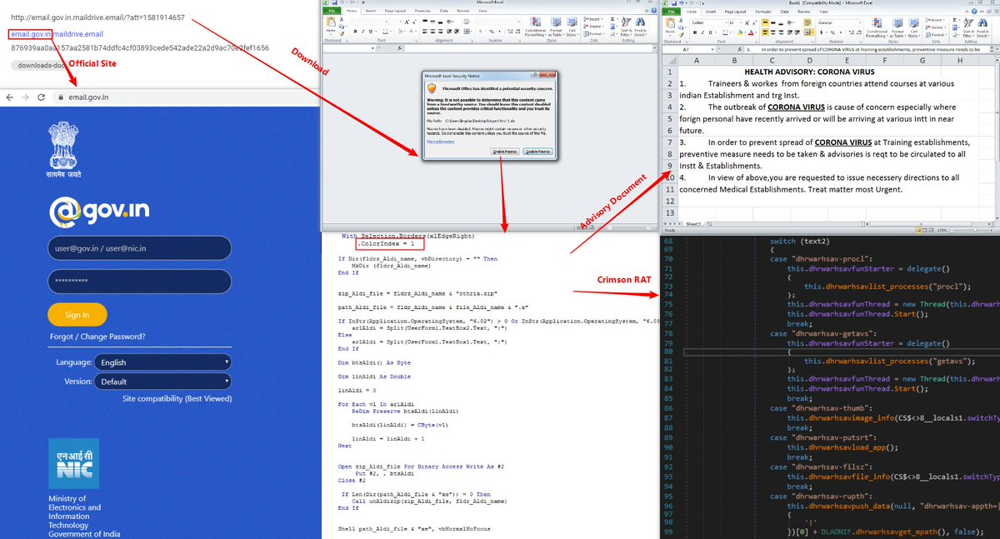

##User: RedDrip7	Time: 20200313
>  #india	 #transparent	 #projectm	 #crimson	 #rat	
 Malicious document, pretending to be from the Government of #India with health advisory of Coronavirus, seems delivered by #Transparent Tribe (#ProjectM). Victims are lured to enable macro to execute #Crimson #RAT payload.

 https://www.virustotal.com/gui/file/876939aa0aa157aa2581b74ddfc4cf03893cede542ade22a2d9ac70e2fef1656/detection … pic.twitter.com/jTsxA38Ubg
 
