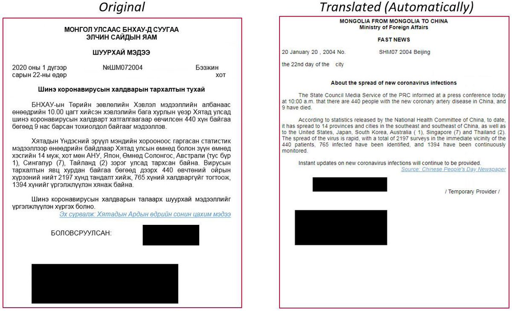
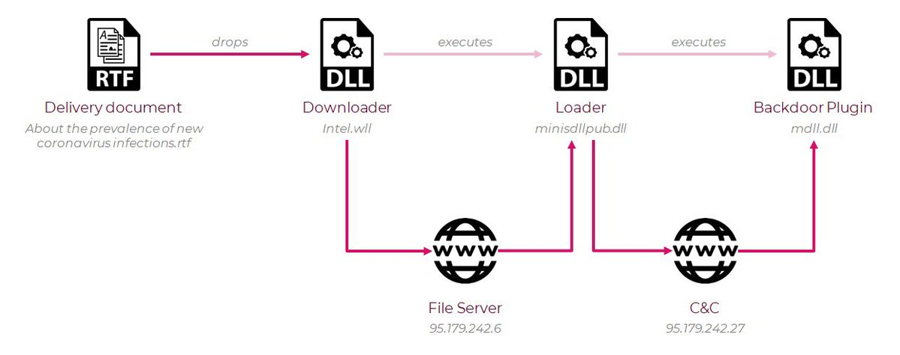

##User: _CPResearch_	Time: 20200313
>  #viciouspanda	
 #ViciousPanda: Chinese APT group after Mongolian targets.

The attackers leveraged weaponized COVID-19 documents to deliver a previously unknown RAT.

The irony was not lost on us. 🐼

Read more @  https://research.checkpoint.com/2020/vicious-panda-the-covid-campaign/ … pic.twitter.com/W6zpQlRrCP
 
 
 
