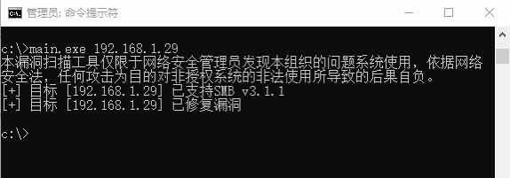

##User: RedDrip7	Time: 20200323
>  #cve	 #smbghost	 #wormable	
 QiAnXin Codesafe Team have developed a tool to discover #CVE-2020-0796 aka #SMBGhost, a #wormable SMBv3 vulnerability remotely without side effects. It can help administrators to quickly identify vulnerable systems. Welcome to download it from:  http://dl.qianxin.com/skylar6/CVE-2020-0796-Scanner.zip … pic.twitter.com/AtbPfsdYXd
 
