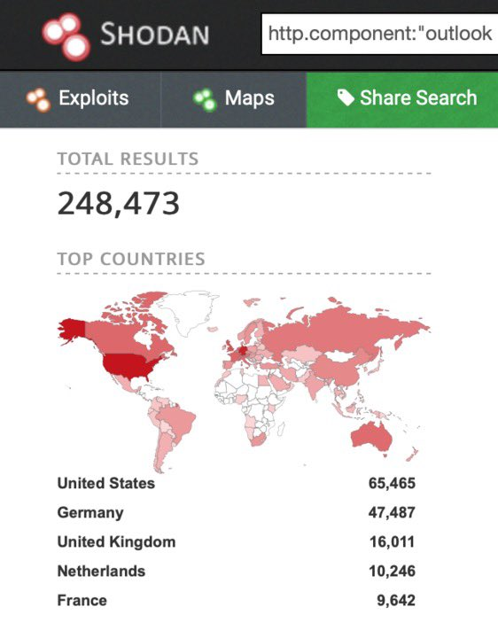

##User: _CPResearch_	Time: 20200325
>  #workingfromhome	
 📈More than 700 new Outlook Web Access servers were exposed to the internet in the last 24 hours - only in the 🇺🇸! 

In a rush to enable working from home, organizations are exposing their assets online, opening themselves to attacks.

#WorkingFromHome
 https://www.shodan.io/search?query= http.component%3A%22outlook+web+app%22 … pic.twitter.com/dEkeOaWW7h
 
