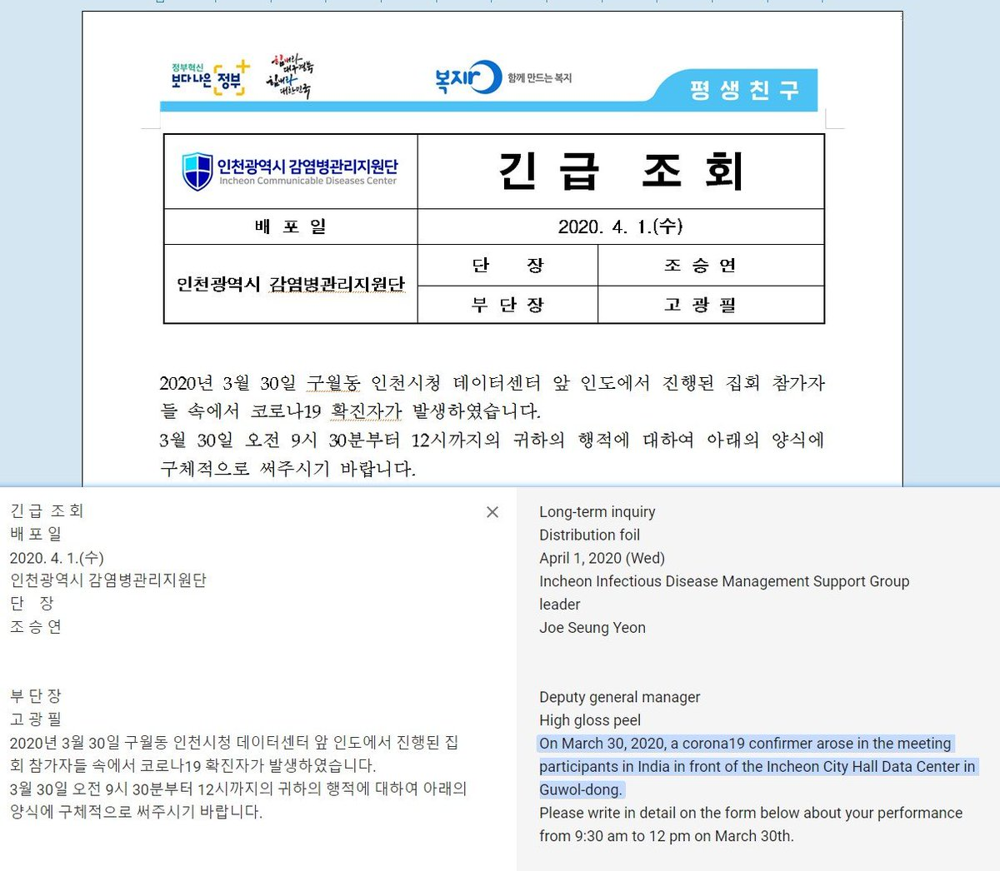

##User: RedDrip7	Time: 20200403
>  #hwp	 #covid	 #lazarus	 #apt	 #south	 #korea	
 #HWP document containing #COVID-19 contents seems utilized by #Lazarus #APT group to attack #South #Korea. A backdoor gets dropped out to perform remote control.

 https://www.virustotal.com/gui/file/c0bd35a36ea5227b9b981d7707dff0e2c5ca87453a5289dc4a5cd04c7e8b728c/details …
 https://www.virustotal.com/gui/file/bd1a0425ffaafa54a1c950fbb3d0defe9fa145131e4bd15d392597de408f5287/details …
 https://www.virustotal.com/gui/file/7050af905f1696b2b8cdb4c6e6805a618addf5acfbd4edc3fc807a663016ab26/details … pic.twitter.com/mn6WWNP7AU
 
