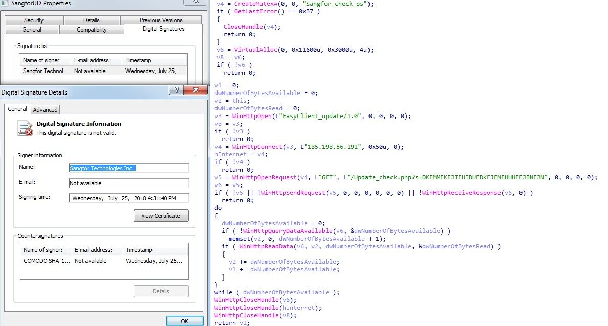

##User: RedDrip7	Time: 20200409
> 
``` Just need to point out that the RedDrip Team belongs to Qi-AnXin Technology ( https://www.qianxin.com/ ) rather than Qihoo 360. They are two separate companies indeed.```
  
  >  #darkhotel	 #apt	 #china	 #sangfor	 #vpn	
``` Seems the #DarkHotel (#APT-C-06) is attacking #China through exploiting #SangFor #VPN vulnerability. The sample pretends to be signed by SangFor Technologies to load a malicious DLL and download payload from remote.
IOC: 185[.]198.56.191

 https://www.virustotal.com/gui/file/d15fe07fda3f9265f5e9f13509e4ff79af446df576f02acecfc7158b0e8b0640 … pic.twitter.com/rq2ozPitQt```
 
  
  