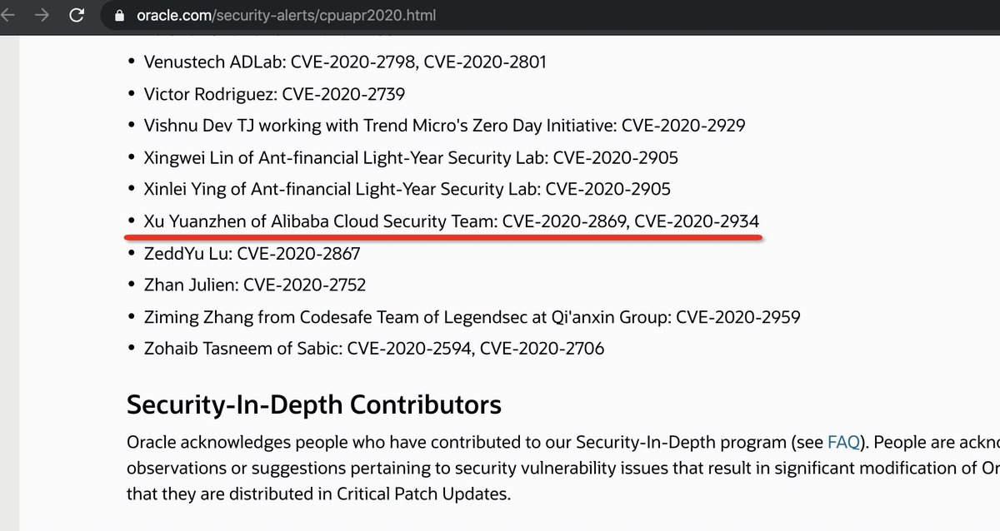

##User: pyn3rd	Time: 20200416
> 
``` Thanks a lot.```
  
  > 
``` It’s also coherence gadget : D```
  
  > 
``` I don’t why. Actually it’s also a RCE vulnerability.```
  
  > 
``` I report three bugs to Oracle, but I don’t why one of them is missed.😅 pic.twitter.com/MJHlvaAfBU```
 
  
  > 
``` Today Oracle has released the Critical Patch Update of April 2020, the guys are big fans of Oracle Weblogic Server.
 https://www.oracle.com/security-alerts/cpuapr2020.html …```
  
  