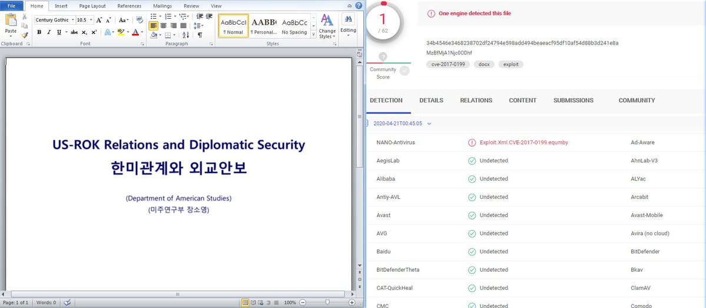

##User: RedDrip7	Time: 20200422
>  #lazarus	 #virustotal	
``` Seems a new sample from #Lazarus detected by only one security vendor on #VirusTotal. It leverages template injection to execute malicious macro and drop a backdoor to control the target computer remotely.

 https://www.virustotal.com/gui/file/34b4546e3468238702df24794e598add494beaeacf95df10af54d88b3d241e8a/detection … pic.twitter.com/6iHlLrYMEZ```
 
  
  