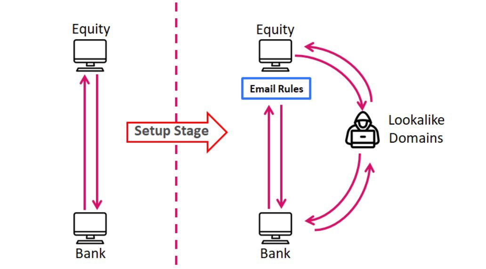
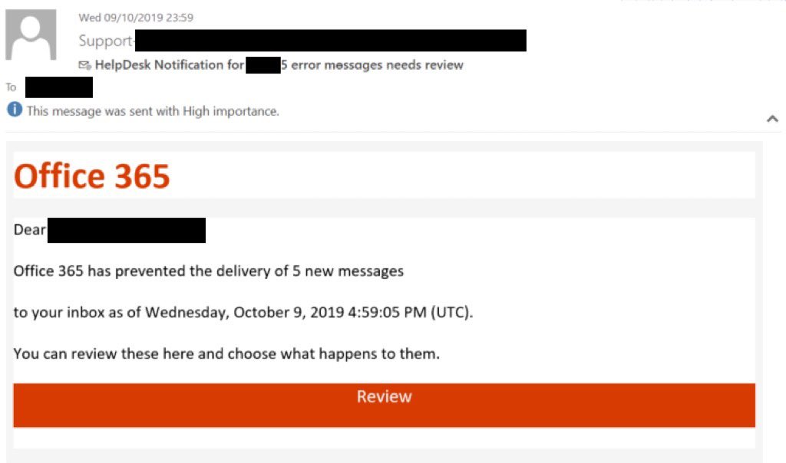

##User: _CPResearch_	Time: 20200424
>  #bec	
``` Meet the Florentine Banker 🕵️
An APT group targeting financial organizations with #BEC attacks.
The story starts with a simple Phishing email, and ends with hundreds of thousands of dollars in the attacker's bank account. 💰

Read more:
 https://research.checkpoint.com/2020/ir-case-the-florentine-banker-group/ … pic.twitter.com/hvzLKYcEaF```
 
 
  
  