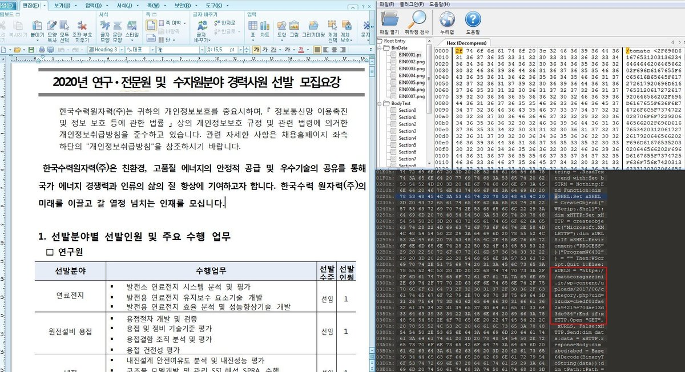

##User: RedDrip7	Time: 20200428
>  #lazarus	 #apt	 #hwp	 #khnp	 #south	 #korea	
``` Seems #Lazarus #APT group uses #HWP document with job openings from #KHNP (Korea Hydro & Nuclear Power) to attack #South #Korea. A backdoor gets dropped out to perform remote control.

 https://www.virustotal.com/gui/file/67a52dbb1067cc4546bb738cc5a77a4bc9ed4e4f5d0febdc4fc0b5427b5d35f9/detection …

reference： https://ti.qianxin.com/blog/articles/analysis-of-lazarus-apt-targeted-attack-against-south-korea-using-new-crown-outbreak-bait/ … pic.twitter.com/3VQI9pzdlS```
 
  
  