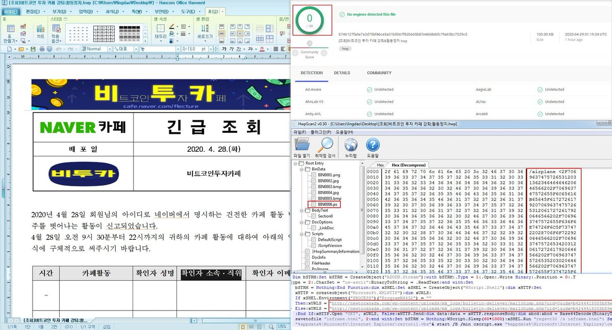

##User: RedDrip7	Time: 20200430
>  #hwp	 #lazarus	 #apt	 #south	 #korea	 #virustotal	 #bitcoin	
``` Another #HWP document  seems utilized by #Lazarus #APT group to attack #South #Korea.The decoy document, currently without any detection on #VirusTotal, contains information about #bitcoin investment cafes to lure victims.

 https://www.virustotal.com/gui/file/b746127fa6e7a2d75bf46ce5a31b50e7f82b665b87e4668ebfc79a65bc7029c5/detection … pic.twitter.com/LQiq7Cm4uV```
 
  
  