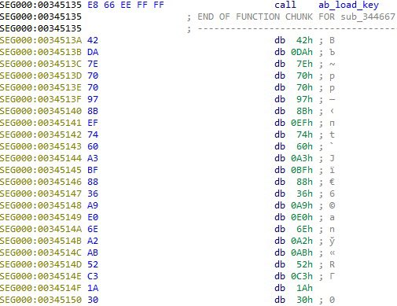
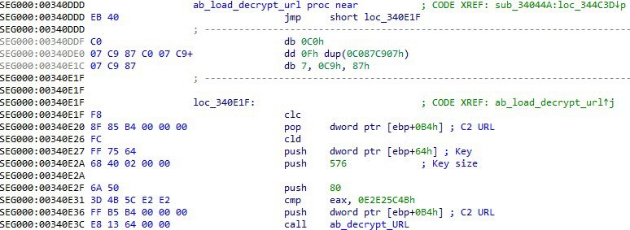
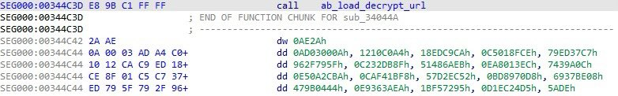

##User: _CPResearch_	Time: 20200504
> 
``` MD5: cbcea8333673b9dcdbbca0c89cfc6eb8
Decrypted C2 URL:  https://drive.google.com/uc?export=download&id=12bQpiw0krWLU8m7TvlcGqMO2rvc47Vbk …```
  
  >  #guloader	
``` We have recently discovered a new version of #GuLoader in the wild, which stores C2 URLs XOR-encrypted using the payload encryption key. 
Payloads for this version additionally XOR-ed with a random 2-bytes key. pic.twitter.com/J1YUvozMQS```
 
 
 
  
  