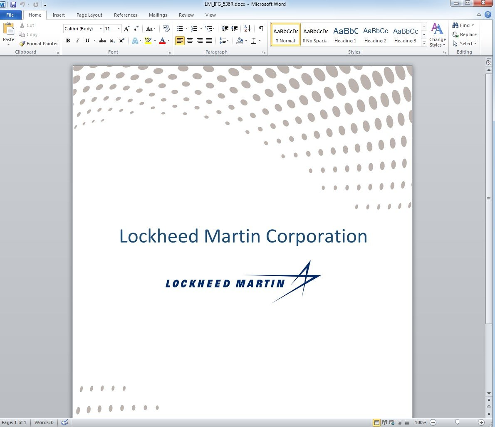

##User: RedDrip7	Time: 20200516
>  #lazarus	 #virustotal	 #lockheed	 #ifg	
``` Seems a new sample from #Lazarus detected by only one security vendor on #VirusTotal. The decoy document pretends to be a job description for #Lockheed Martin Aeronautics Integrated Fighter Group (#IFG) in the US.

 https://www.virustotal.com/gui/file/df5536c254a5d9ac626dbff7525de8301729807433d377db807ce3d8bc7c3ffe/details …
 https://www.virustotal.com/gui/file/6a3446b8a47f0ab4f536015218b22653fff8b18c595fbc5b0c09d857eba7c7a1/details … pic.twitter.com/jPQwSu0nI8```
 
  
  