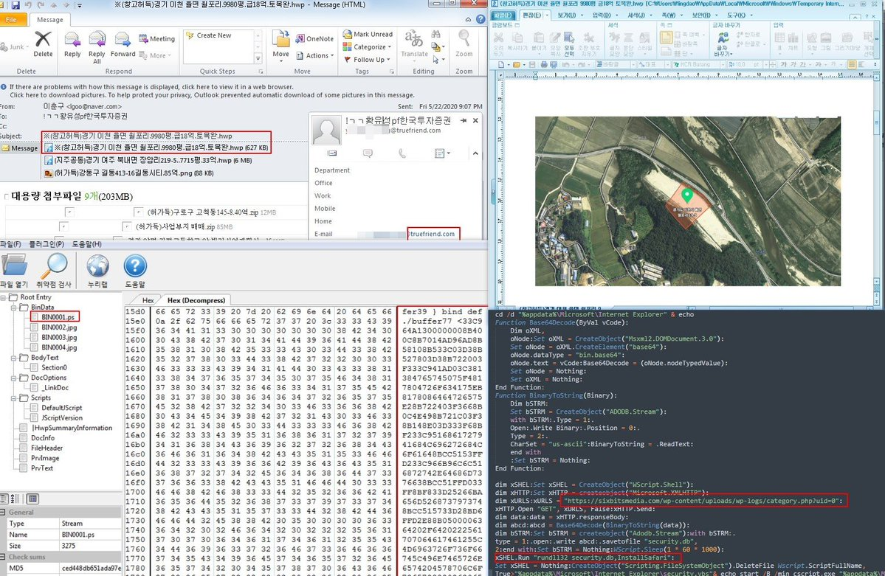

##User: RedDrip7	Time: 20200527
>  #lazarus	 #apt	 #phishing	 #south	
``` Seems #Lazarus #APT group performs spear #phishing attacks against #South Korea Investment & Securities Corporation ( http://www.truefriend.com ). The malicious attachments will download and execute a backdoor.

 https://www.virustotal.com/gui/file/d68e09cff6a20c3dab3c36e026d10a153ef5847e97c4b6e11f6c7756f00223c3/ … pic.twitter.com/rVjLhbvfmV```
 
  
  