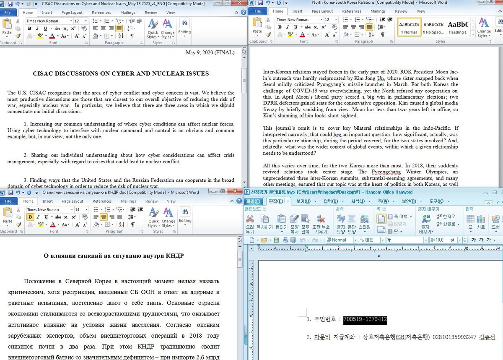

##User: RedDrip7	Time: 20200529
>  #konni	 #apt	 #hwp	
``` The #Konni #APT group is quite active recently by using #hwp files and documents with malicious macro to perform attacks.

 https://www.virustotal.com/gui/file/6d83845271b672c84d9af8ab4527ce79ffcd980aa29f57a9f4e46498439646b6 …
 https://www.virustotal.com/gui/file/c3299100f8f982bca64a371223b9b2ae30d3d842fbffbc9f13de8ca77f6f44c5 …
 https://www.virustotal.com/gui/file/53dcfcc9537ec2df87924938151b39556677d73d48ac59fbd536d7119c2ebda8 …
 https://www.virustotal.com/gui/file/174e76656a8dae3c3cc746958dcb1456db4da9898227432923e2148b7e76ec31 …
 https://www.virustotal.com/gui/file/b85d68d3f7c4f70ca85d16e8864b4f9ca9a234bb57bfe9e9e4c9f270d1848bec … pic.twitter.com/2TB3pGWJr9```
 
  
  