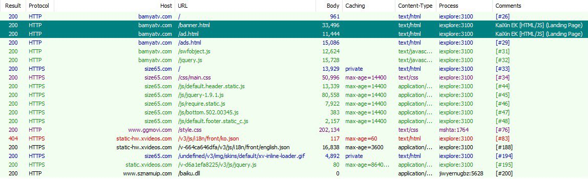
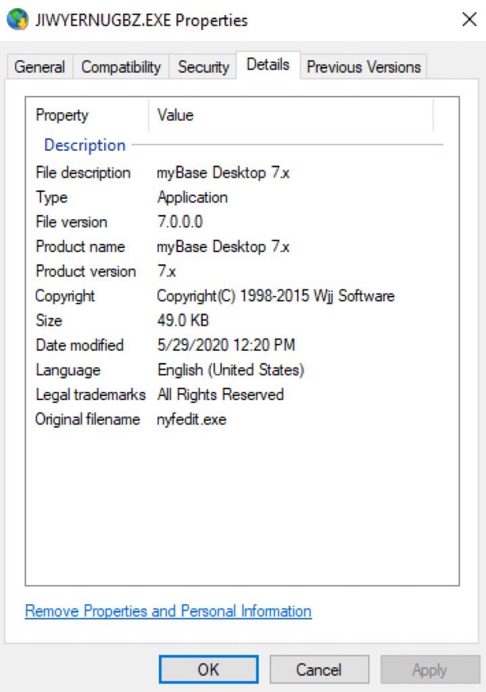

##User: _CPResearch_	Time: 20200601
>  #kaixinek	 #dupzom	
``` #KaiXinEK survives the COVID-19

Landing pages:
154.204.42[.]27 & 154.197.26[.]198 (AS133199, SonderCloud)
ggmovi[.]com,sznamu[.]com, bamyatv[.]com,sz1004[.]com
 https://app.any.run/tasks/24296541-77b7-43ee-a7ee-6082572638e7 …

Final payload - #Dupzom
 https://www.virustotal.com/gui/file/f3fc08d546e93052dba8418cda825af012150b9b697bb82c3c4abfcf9c6ac615 …
C&C: sznamuip[.]com/baiku.dll 154.204.50[.]136 pic.twitter.com/0OKrbkmNto```
 
 
  
  