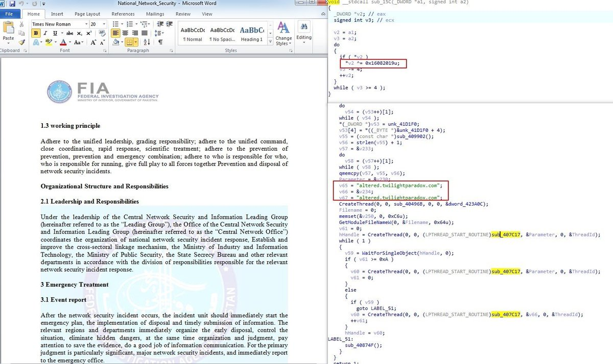

##User: RedDrip7	Time: 20200618
>  #patchwork	 #fakejli	 #cve	
``` #Patchwork seems using a new sample to carry out attacks with National Network Security Incident Contingency Plans as a bait. #FakeJLI backdoor gets dropped out through #CVE-2017-0261.

 https://www.virustotal.com/gui/file/22960057a38990ed2b0d79b2554c6364f15ea74a8cf1ab257f01e4f39b9851ea … pic.twitter.com/Fu1WSANUhh```
 
  
  