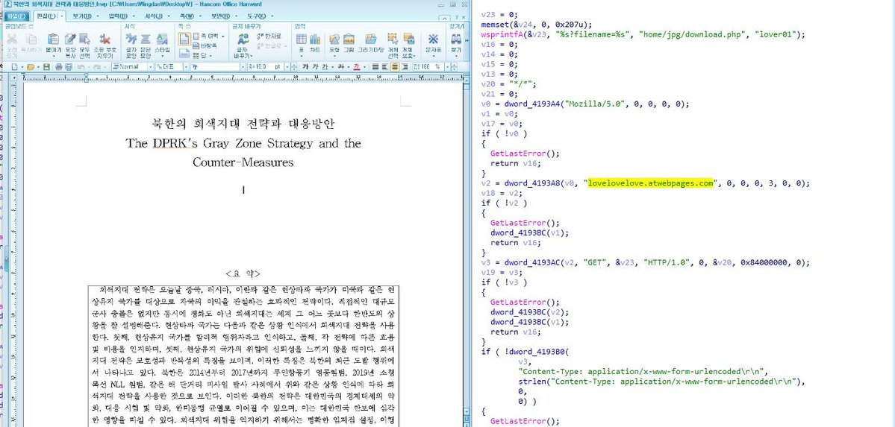

##User: RedDrip7	Time: 20200704
>  #kimsuky	 #apt	 #hwp	 #south	 #korea	
``` Seems #Kimsuky #APT group uses #HWP document regarding the DPRK's Gray Zone Strategy and the Counter-Measures to attack #South #Korea. A backdoor gets dropped out to perform remote control.

 https://www.virustotal.com/gui/file/c6661195693d0f09d70c643f87194282593ef0d6a0e349720310d760d002e062 … pic.twitter.com/0MMHPD18cp```
 
  
  