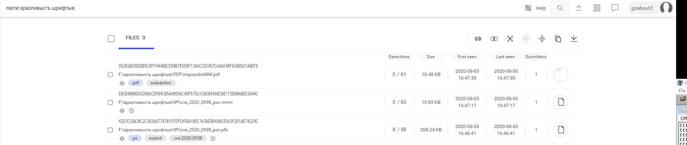
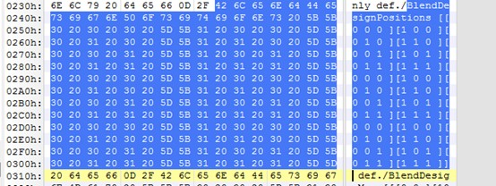
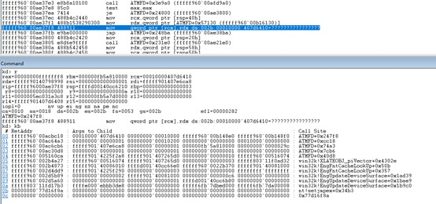

##User: RedDrip7	Time: 20200812
>  #poc	 #exploit	 #cve	 #type1	 #ukraine	
``` Seems a #PoC #Exploit of #CVE-2020-0938 #Type1 font vulnerability has been uploaded to VT from #Ukraine. The system gets crashed when triggered successfully.

 https://www.virustotal.com/gui/file/42d3ccba38c2c3b36877a781ffdfe4fba105c763ad9b49653563f2b1ae74224c/detection … pic.twitter.com/SnWufv6RBX```
 
 
 
  
  