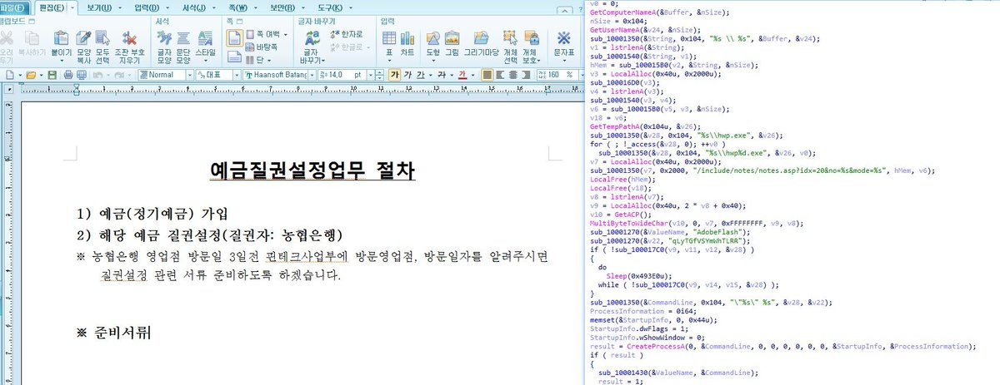

##User: RedDrip7	Time: 20200813
>  #lazarus	 #unsunozo	
``` Seems a new sample from #Lazarus pretending to be a deposit pledge setting document.The attacker hacked the web server of #unsunozo to deliver C2 commands.

C2:www[.]unsunozo[.]org/include/notes/notes.asp?idx=20&no=%s&mode=%s

 https://www.virustotal.com/gui/file/b0921142f8d3067c8253931977999a5092470ff3e562586d87af68c28ec66a99/ … pic.twitter.com/DVClMEGRpX```
 
  
  