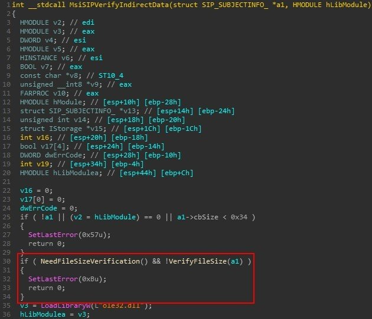
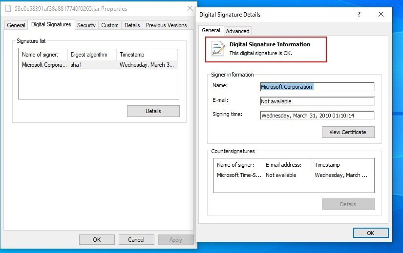

##User: RedDrip7	Time: 20200815
>  #cve	 #wild	 #signed	 #jar	 #msi	 #microsoft	
``` Seems #CVE-2020-1464 gets exploited in the #wild to load improperly #signed files. A malicious #JAR is appended to a #MSI file properly signed by #Microsoft, and the victim gets infected when double clicking the .jar sample renamed by the attacker.

 https://www.virustotal.com/gui/file/0f4238c3b41b99fd94f264b0df5b0400906a7e20af82107476dca4723aeb66bf/detection … pic.twitter.com/Dnho3iJSYR```
 
 
  
  