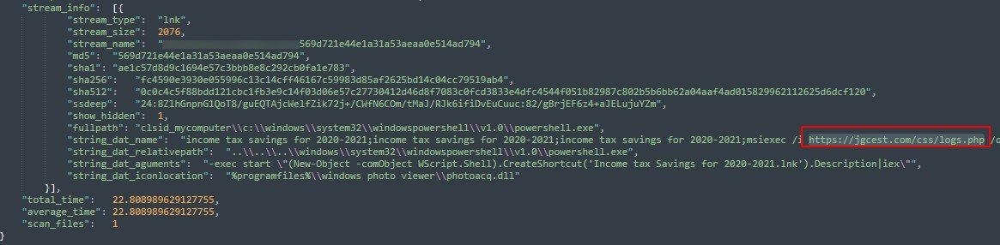
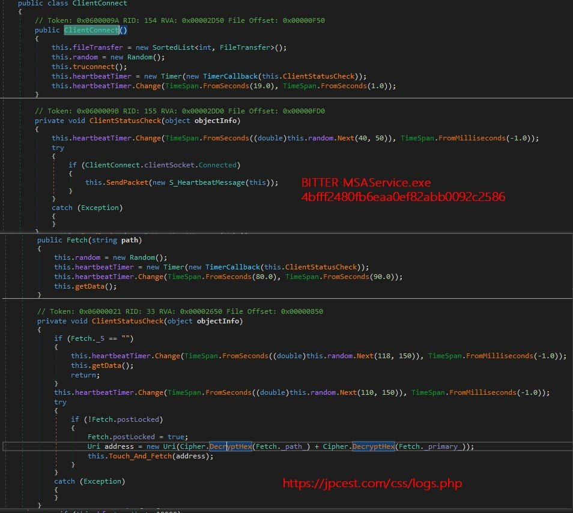

##User: RedDrip7	Time: 20200911
>  #lnk	 #bitter	 #apt	
``` An #LNK sample seems used by the #Bitter #APT group in the new attack. The malicious MSI payload retrieved from remote behaves similar to the .NET backdoor disclosed previously.

 https://www.virustotal.com/gui/file/fc4590e3930e055996c13c14cff46167c59983d85af2625bd14c04cc79519ab4/details … pic.twitter.com/Cp4JLfMP90```
 
 
  
  